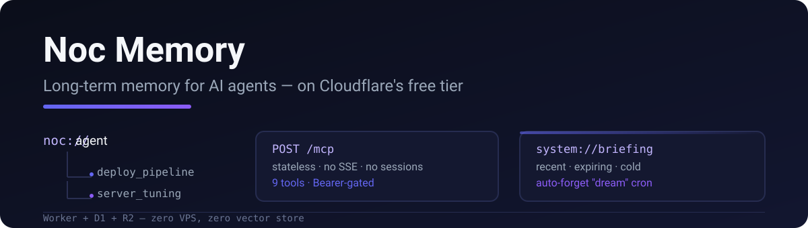

# Noc Memory (cf-noc-mem)

<p align="center">
  
</p>

<p align="center">
  <a href="https://deploy.workers.cloudflare.com/?url=https://github.com/RealAlexandreAI/cf-noc-mem"></a>
</p>

一个无状态、单用户的 **AI agent 长期记忆服务器**，完全跑在 Cloudflare 免费额度内。没有 VPS、没有数据库服务器、没有向量库——只有一个 Worker + D1 + R2。

> 基于上游 [nocturne_memory](https://github.com/Dataojitori/nocturne_memory) 的记忆图谱概念，重写为无服务器架构，并裁剪到一个人真正需要的程度。也可作为 agent 插件使用：[dsh-noc-memory](https://github.com/RealAlexandreAI/dsh-noc-memory) · [pi-noc-memory](https://github.com/RealAlexandreAI/pi-noc-memory)。

## 为什么

大多数"agent 记忆"方案是在聊天客户端上外挂一个向量数据库。Noc Memory 把记忆当作**层级树**（`noc://agent`、`noc://agent/deploy_pipeline`……），带版本化内容、触发关键词和审计回滚——agent 可以探索、更新、甚至纠正自己过去的认知。

- **零基础设施**：Worker + D1 + R2，全部在 Cloudflare 免费额度内
- **无状态 MCP**（Streamable HTTP）：没有 SSE、没有会话——agent 只需 `POST /mcp`
- **树形记忆**：`noc://` URI，通过 `list_memories` 浏览
- **触发词召回**：绑定到记忆的关键词排在全文搜索之前
- **语义搜索** *（可选）*：多语言 embedding（bge-m3）+ Vectorize，把语义召回与关键词搜索合并——见 [§9](#9可选语义搜索-vectorize)
- **前瞻（Foresight）**：记忆可以带过期时间——过期后自动退出搜索
- **每日简报**：`system://briefing`——最近变更、即将过期、冷记忆一览
- **焦点视图**：`system://focus`——最近更新的记忆按工作树聚合，长周期工作无需翻找即可续作
- **审计 + 回滚**：每次变更都有记录；错了可以撤销
- **自动遗忘**（"dream"）：cron 定时清除旧版本、过期内容和长期未访问的低等级记忆——无需人工清理

## MCP 工具（12 个）

| 工具 | 作用 |
|------|------|
| `read_memory(uri)` | 按 URI 读取；也支持 `system://boot`、`system://briefing`、`system://focus`、`system://index/<domain>`、`system://recent[/N]` |
| `list_memories(uri, limit?)` | 浏览某 URI 下的子记忆 |
| `create_memory(parent_uri, content, priority, disclosure, expires_at?)` | 在已有父节点下创建 |
| `update_memory(uri, append?/old_string+new_string?, priority?, disclosure?, expires_at?, relation?)` | 新增版本行；`relation` 标记演变关系：`replace|enrich|confirm|challenge` |
| `delete_memory(uri)` | 切断一个 URI 路径；返回被孤立的子节点（如有） |
| `add_alias(new_uri, target_uri, …)` | 给同一记忆加另一条路径 |
| `search_memory(query, limit?)` | 先触发词召回，再 FTS5 trigram（对中文友好），最后 LIKE 兜底；配置 Vectorize 时合并语义结果（可选） |
| `rollback_memory(audit_id)` | 从审计日志撤销一次变更 |
| `manage_triggers(action, keyword, target_uri?)` | 添加 / 删除 / 列出触发关键词 |
| `rename_memory(uri, new_name)` | 重命名最后一段路径（节点与内容不变，搜索索引重建，子路径跟随迁移） |
| `list_audit(uri?, limit?)` | 浏览最近审计记录，取 `audit_id` 用于回滚 |
| `reindex_vectors()` | *（可选）* 为全部已有记忆补建语义向量；未配置 Vectorize 时为空操作——只在已存了大量记忆后启用 §9 时才需要 |

另外：`create_memory` 支持显式 `title`（路径名），内容首行不再被吞；REST API 可通过 `/api/*` + Bearer 直接访问。

## 部署到自己的 Cloudflare

### 1. 前置条件

- [Cloudflare 账号](https://dash.cloudflare.com)——**免费计划即可**：本项目就是按免费额度设计的（Workers 每天 10 万请求、D1 5 GB、R2 10 GB）。个人使用无需付费升级。
- [wrangler](https://developers.cloudflare.com/workers/wrangler/) CLI，已登录
- 一个可以加 DNS 记录的域名（或用默认的 `*.workers.dev`）

### 2. 克隆并安装

```bash
git clone https://github.com/RealAlexandreAI/cf-noc-mem.git
cd cf-noc-mem
npm install
npx wrangler login   # 如果还没登录
```

### 3. 配置

```bash
# 你的 MCP Bearer 密钥（agent 用它认证）
echo -n "$(openssl rand -hex 24)" | npx wrangler secret put API_TOKEN

# 本地开发密钥（仅用于 npx wrangler dev）
echo "API_TOKEN=dev-token" > .dev.vars
```

### 4. 开通 D1 + R2

```bash
# 创建数据库 + 存储桶
npx wrangler d1 create noc_mem
npx wrangler r2 bucket create noc-mem-snapshots
```

然后把 `wrangler.jsonc` 复制成 `wrangler.local.jsonc`（已被 git 忽略），把上面命令输出的 id 填进去——真实 id 不进 git：

```bash
cp wrangler.jsonc wrangler.local.jsonc
# 编辑 wrangler.local.jsonc：填 database_id + 你的域名（用 *.workers.dev 就删掉 routes 块）
```

```jsonc
"d1_databases": [{ "database_name": "noc_mem", "database_id": "<粘贴到这里>" }],
"r2_buckets":   [{ "bucket_name": "noc-mem-snapshots" }]
```

```bash
# 应用表结构
npx wrangler d1 migrations apply noc_mem --remote
```

### 5. 部署

```bash
npm run build --prefix frontend   # 构建管理面板
npx wrangler deploy --config wrangler.local.jsonc   # 真实 id 来自本地配置
```

### 6. 绑定域名（可选）

Workers 会自动获得 `https://<worker-name>.<你的子域>.workers.dev`。要用 `mem.example.com` 这类自定义域名：加一条指向你 worker 的 `*.workers.dev` 主机的 CNAME 记录，然后在控制台：Worker → Settings → Domains & Routes → Add → Custom Domain。

### 7. 验证

```bash
# MCP 握手（Bearer 认证）
curl -X POST https://mem.example.com/mcp \
  -H "Content-Type: application/json" \
  -H "Authorization: Bearer $API_TOKEN" \
  -d '{"jsonrpc":"2.0","id":1,"method":"initialize","params":{}}'

# 管理面板在 /admin/（任何非 /admin 路径都会 302 过去）
open https://mem.example.com/admin/
```

### 8. 保护管理面板（推荐）

整个面板都在 `/admin` 下；`/mcp` 和静态资源保持公开（MCP 有 Bearer 门控，静态资源只是没有数据的 UI 壳）。把面板放到 **Cloudflare Access** 后面：

- Zero Trust → Access → Applications → Add → self-hosted
- Domain: `mem.example.com/admin` → policy: 只允许你的邮箱
- `/mcp` 留在 Access 之外——agent 只用 Bearer 访问

### 9.（可选）语义搜索（Vectorize）

**关键词搜索是默认能力，零额外配置即可用**（触发词 → FTS5 trigram → LIKE）。语义搜索是**可选的附加功能**，解决"记忆与查询概念相关但毫无共同关键词"的场景——比如搜"部署失败"也该召回一条写着"发布流水线挂了，回滚后恢复"的记录。

- **成本**：Vectorize 和 Workers AI embedding 都在免费额度内，个人使用远用不完。不需要语义召回就整节跳过。
- **原理**：每次记忆写入/更新/重命名/删除时，`@cf/baai/bge-m3`（多语言、支持中文）把标题+内容嵌成 1024 维向量存入 `noc-mem-vec` 索引；`search_memory` 把语义命中与关键词命中合并（去重，语义优先）。
- **优雅降级**：Vectorize/AI 都是可选绑定——未绑定或出错时搜索静默回退为纯关键词，记忆写入永远不会因此失败。

启用步骤：

```bash
# 1. 创建索引（一次性）
npx wrangler vectorize create noc-mem-vec --dimensions 1024 --metric cosine

# 2. 在 wrangler.local.jsonc（以及若用 wrangler.jsonc 部署）加绑定
# "ai": { "binding": "AI" },
# "vectorize": [{ "binding": "VECTORIZE", "index_name": "noc-mem-vec" }]

# 3. 重新部署后，为启用前已写入的记忆补建向量：调用 MCP 工具 reindex_vectors()
#    ——或者不调用；之后的写入会自动索引
```

启用后 `search_memory` 返回语义 + 关键词结果；`reindex_vectors` 报告 `ok/total`，失败项以 `vector_upsert_failed` 出现在 Workers Logs。

## 前端

`frontend/` 下是一个 React 管理面板（Vite），由 Worker 的 assets binding 提供。两个页面：

- `/admin/review` — **记忆准入**：审计日志里的待审批变更；批准或回滚
- `/admin/memory` — **记忆浏览**：记忆树（`noc://`）、搜索、创建/编辑/删除、触发关键词、启动项列表

## Agent 插件

部署一次，然后任意 agent 都能接进来：

- **[dsh-noc-memory](https://www.npmjs.com/package/dsh-noc-memory)** — dsh 插件：会话开始自动加载启动记忆 + 每日简报 + 记忆工具（`dsh plugin --profile web add dsh-noc-memory`）
- **[pi-noc-memory](https://www.npmjs.com/package/pi-noc-memory)** — pi 扩展：`SessionStart` 启动协议 + 记忆规则（`pi install npm:pi-noc-memory`）

两者都用 Bearer token 访问你的 `/mcp` 端点。

## 手动 MCP 配置（不装插件）

不需要插件——任何支持 **Streamable HTTP** 的 MCP 客户端都能直接连你的服务器。端点是 `https://<你的域名>/mcp`，用 `Authorization: Bearer <API_TOKEN>` 头认证（就是第 3 步设置的那个 token）。

通用的 `mcpServers` 配置（Claude Code、Cursor、VS Code 等）：

```json
{
  "mcpServers": {
    "noc-memory": {
      "type": "http",
      "url": "https://mem.example.com/mcp",
      "headers": {
        "Authorization": "Bearer YOUR_API_TOKEN"
      }
    }
  }
}
```

Claude Desktop（`claude_desktop_config.json`）用同样的结构：

```json
{
  "mcpServers": {
    "noc-memory": {
      "type": "http",
      "url": "https://mem.example.com/mcp",
      "headers": {
        "Authorization": "Bearer YOUR_API_TOKEN"
      }
    }
  }
}
```

连上后，agent 直接看到全部 11 个工具（`read_memory`、`list_memories`、`create_memory`……）。上面的插件只是锦上添花——会话开始自动加载启动记忆 + 记忆写入规则——都不是记忆服务器工作的必需项。

### 不装插件时的 agent 规则

插件除了工具外还做两件事：**会话开始自动 boot** 和**记忆写入规则**。手动配置两者都没有——把下面这段规则加进你的 agent（CLAUDE.md、`.cursor/rules` 或任意系统提示词），记忆才会真正被用起来：

```markdown
## Noc Memory 使用规则

### 会话开始
- 先 `read_memory` 读 `system://boot`——它用核心记忆锚定本次会话。
- 再读 `system://briefing` 获取今日上下文（近期活动、即将过期、冷候选）。
- 再读 `system://focus` 看哪些工作树最近在动——直接续上活跃的那个。（`system://recent` 是简报的子集，不必单独读。）

### 读取
- 优先 `search_memory` 而不是浏览——它能把绑定触发词的记忆顶到 FTS 噪音之上。
- 定期读 `system://diagnostic/noc`，发现陈旧、孤儿或过于拥挤的记忆。

### 写入
- 拉取式：只写你以后会再查的东西。跳过临时信息（任务流水、一次性事实）。
- 先搜再写：同话题 → `update_memory`；新话题 → `create_memory`。
- 记忆演进时优先用 `content=` 整体重写，而不是 `append` 追加。
- 新信息与旧记忆矛盾 → `update_memory` 且 `relation: "challenge"`。
- 父路径：通用知识用 `noc://agent`；领域知识用项目节点（如 `noc://agent/<项目>`）。
- `priority`：0 = 最重要（优先召回）；数字越大越次要。
- `expires_at`：临时知识（会议纪要等）设置它，到时自动淘汰。
- `disclosure`：敏感内容标记上。
- title 保持简短 ASCII——它会被用作 URI 路径。
- 用 `manage_triggers` 给深层记忆绑关键词，之后搜索能直接召回。

### 维护
- 节点保持扁平：共性放父节点，细节放子节点。
- 一条记忆再也读不到时，先问为什么，再决定是否保留。
```

这正是 [pi 插件的规则](https://github.com/RealAlexandreAI/pi-noc-memory)在会话开始注入的内容——手动配置只是让你自己保管这份拷贝。

## 测试

前端单元测试（vitest）：

```bash
cd frontend
npm test          # 监听模式
npm run test:run  # 单次执行（适合 CI）
```

Worker 脚本（`package.json`）：`npm run dev`（wrangler dev）、`npm run deploy`、`npm run db:migrate:remote`。

## 许可证

MIT——fork 它、部署它、改成你自己的。

## 相关

- [dsh-noc-memory](https://github.com/RealAlexandreAI/dsh-noc-memory) — dsh 插件，同样的记忆工具
- [pi-noc-memory](https://github.com/RealAlexandreAI/pi-noc-memory) — pi 扩展（会话开始启动 + 简报）
- [nocturne_memory](https://github.com/Dataojitori/nocturne_memory) — 本项目派生自的上游项目
